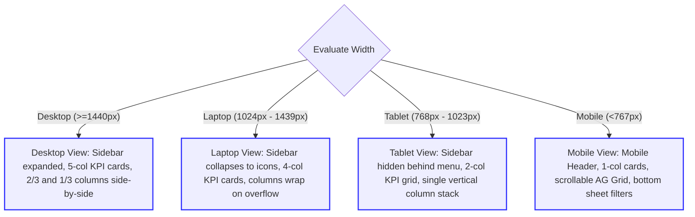

# HRMS Enterprise Admin Web Application: Dashboard Module Architecture

This document defines the comprehensive planning and frontend architecture for the **Dashboard Module** of the **Enterprise HR & Payroll Management System (HRMS) Admin Web Application**. The dashboard serves as the landing page immediately upon successful authentication, functioning as the central command center for HR managers, branch administrators, and payroll executives. 

This is a **planning-only document** and contains no production code, UI generations, or concrete backend implementations. It is written to align with the existing styling system (Tailwind CSS v4 + HSL tokens), routing layout framework, auth/RBAC models, and frontend guidelines established in the workspace.

---

## 1. Dashboard Purpose

### Business Objective
The primary business objective of the HRMS Dashboard is to provide administrators and managers with real-time operational visibility and decision-making capabilities regarding workforce management. By consolidating attendance logs, biometric hardware status, shift coverage, and pending approvals, the dashboard reduces response time for administrative bottlenecks, safeguards operational continuity, and streamlines payroll preparation.

### User Goals
*   **Real-time Availability Tracking:** Monitor which employees are currently present, on break, out, or absent on any given date/shift.
*   **Operational Conflict Resolution:** Quickly identify and resolve biometric sync failures or missing attendance logs.
*   **Actionable Task Management:** Accelerate business workflows by displaying a unified backlog of pending approvals (e.g., leave requests, attendance corrections) requiring immediate attention.
*   **Hardware Monitoring:** Minimize clock-in downtime by verifying the connection status of biometric terminal devices across different branches.
*   **Data Scoping & Governance:** View analytical metrics strictly scoped to the user’s authorized branch and department, preventing unauthorized access to corporate salary and headcount details.

### Information Hierarchy
The dashboard interface is structured into three tiers of importance, optimizing scanability and actionability:
1.  **High-Level KPI Summary (Top Tier):** Immediate operational indicators showing organization-wide metrics (Total Headcount, Currently Working, On Break, Time Off, Pending Biometrics). These metrics are vital for high-level daily assessments.
2.  **Interactive Live Summary & Roster (Middle Tier - Left Side):** The **Attendance Summary Section** and **Live Attendance Table**. This area is highly dynamic, enabling users to drill down into active shifts, search for specific employees, and launch punch correction drawers.
3.  **Operational Sidebars (Middle/Lower Tier - Right Side):** Health widgets, including **Device Status**, **Shift Summary**, **Department Summary**, and **Pending Approvals**. These widgets display aggregated data, status indicators, and quick-action links.

---

## 2. Dashboard Layout Architecture

The dashboard is mounted at `/dashboard` within the `(dashboard)` Route Group and inherits the shell provided by `src/app/(dashboard)/layout.tsx`. It fits into a high-density, grid-based layout.

### Overall Page Structure
The content flow is structured inside a vertical flexbox wrapping a responsive grid:

```
+------------------------------------------------------------------------------------------------------+
|                                  Dashboard Header & Scope Selectors                                 |
|  [Breadcrumbs: Home / Dashboard]                [Branch Filter: All]    [Department Filter: All]     |
+------------------------------------------------------------------------------------------------------+
|                                          Row 1: KPI Summary Cards                                    |
| [ Total Employees ] [ Currently Working ] [ On Break ] [ Time Off Today ] [ Pending Biometrics ]     |
+------------------------------------------------------------------------------------------------------+
| Row 2: Main Workspace Grid (Two Columns: 2/3 Content, 1/3 Sidebar)                                   |
|                                                                                                      |
|  +-------------------------------------------------------+  +-------------------------------------+  |
|  |  Attendance Summary Section                           |  |  Device Status Widget               |  |
|  |  [ Morning Shift ] [ Evening Shift ] [ Night Shift ]  |  |  - Device #1: Online                |  |
|  |  [ Date Picker: 2026-07-15 ]                          |  |  - Device #2: Offline               |  |
|  |                                                       |  +-------------------------------------+  |
|  |  +-------------------------------------------------+  |  |  Pending Approvals Widget           |  |
|  |  | Attendance Summary Stats (Present/Late/Absent)  |  |  |  - Leave Requests (5)               |  |
|  |  +-------------------------------------------------+  |  |  - Corrections (3)                  |  |
|  |                                                       |  +-------------------------------------+  |
|  |  Live Attendance Table (AG Grid Wrapper)              |  |  Shift Summary Widget               |  |
|  |  [ Search... ] [ Filter ]                             |  |  - Morning Shift Coverage: 92%      |  |
|  |  +-------------------------------------------------+  |  +-------------------------------------+  |
|  |  | Emp Code | Name | Department | First In | Out |  |  |  Department Summary Widget          |  |
|  |  |----------|------|------------|----------|-----|  |  |  - Sales (12 Present)               |  |
|  |  +-------------------------------------------------+  |  +-------------------------------------+  |
|  +-------------------------------------------------------+  +-------------------------------------+  |
+------------------------------------------------------------------------------------------------------+
```

### Content Flow (Top to Bottom)
1.  **Header Actions & Context Scope Selector:** 
    *   Dynamic breadcrumb tracker resolving back to `"Home / Dashboard"`.
    *   Interactive filter controls (Zustand-powered) enabling administrators to switch active branches and departments. Headcount and widget data instantly update.
2.  **Row 1: KPI Cards (Grid: 5 Columns on Desktop):**
    *   Displays high-density statistic cards (Total Employees, Currently Working, On Break, Time Off, Pending Biometrics) with secondary trend indicator vectors.
3.  **Row 2: Dual Column Workspace Grid (Grid: `grid-cols-1 lg:grid-cols-3`):**
    *   **Primary Column (`lg:col-span-2`):**
        *   **Attendance Summary Card:** Segmented tabs for filtering shifts, a calendar input element, and a summary visualization (Late/On-time punch status counts).
        *   **Live Attendance Table:** Implements the `DataGrid` wrapper component, displaying active punch statuses with in-row trigger actions.
    *   **Operational Sidebar Column (`lg:col-span-1`):**
        *   Vertically stacked widgets: Device Status, Pending Approvals, Shift Summary, and Department Summary.

---

## 3. Dashboard Widget Architecture

All dashboard widgets are encapsulated in `src/features/dashboard/components/` and extend a unified container molecule (`MetricCard` or `DashboardWidget`).

### Container Standard Specification
```typescript
interface DashboardWidgetProps {
  title: string;
  subtitle?: string;
  actionButton?: React.ReactNode; // e.g. "View All" link
  isLoading?: boolean;
  isError?: boolean;
  onRetry?: () => void;
  className?: string;
  children: React.ReactNode;
}
```

Every widget complies with these architectural parameters:
*   **Purpose:** Clear vertical-slice business objective.
*   **Data Displayed:** Read-only values mapped from TanStack Query hooks.
*   **User Interactions:** Hover states, drill-downs, dynamic actions, and contextual tooltips.
*   **Future Scalability:** Encapsulated interfaces to support charts, exports, and real-time updates without impacting sibling widgets.

---

## 4. Summary Cards (KPIs)

These high-density metrics reside at the top of the dashboard. Each card is structured using the standard design tokens: `--card` background, `shadow-base`, `border-border`, and `rounded-md`.

| KPI Metric Card | Purpose | Data Properties | User Interactions & Drill-Downs |
| :--- | :--- | :--- | :--- |
| **Total Employees** | Tracks active headcount within the organization/branch scope. | Count value (Integer), delta indicator compared to previous month (+/- %). | Clicking navigates to `/employees` with the default "Active" filter. |
| **Currently Working** | Monitors real-time active personnel currently clocked in. | Count value (Integer), percentage of total scheduled headcount currently present. | Clicking filters the Live Attendance Table to show only "Working" status. |
| **On Break** | Identifies employees currently in an inactive break state. | Count value (Integer), average break duration for the day. | Clicking filters the Live Attendance Table to show "On Break" status. |
| **Time Off** | Tracks approved absences for the day. | Count value (Integer), breakdown of leave types (Casual, Sick, LWP). | Clicking redirects to the `/leaves` module. |
| **Pending Biometrics** | Identifies hardware onboarding bottlenecks. | Count value (Integer), list of employees lacking device mapping. | Clicking opens the employee list filtered by "Missing Biometrics". |

### Card Visual Tokens & States
*   **Layout:** Horizontal alignment containing an icon container on the left (light theme uses HSL `var(--primary)` background with 10% opacity; dark theme uses vibrant blue tint), metric on the right.
*   **Status Color Coding:**
    *   *Currently Working:* Emerald Green (`var(--success)` tint).
    *   *On Break:* Amber Orange (`var(--warning)` tint).
    *   *Pending Biometrics:* Rose Red (`var(--destructive)` tint).

---

## 5. Attendance Summary Section

This section displays daily attendance details and includes controls for filtering the workspace.

### Shift Tabs & Navigation
*   **Shift Tabs:** Dynamically loaded from the active organization's shift policies (e.g., "All Shifts", "General Morning Shift", "Evening Core Shift", "Night Shift"). Selecting a tab filters the underlying attendance statistics and table.
*   **Date Selector:**
    *   Single-day calendar input (defaults to `today` in localized timezone).
    *   "Prev" and "Next" icon buttons allow users to toggle between dates.
    *   Toggling back in time shifts the dashboard into "Archive Mode", disabling live hardware streams and replacing them with read-only database queries.

### Attendance Summary Cards
Displays three secondary metric indicators:
1.  **On Time:** Number of employees who punched in before their shift start grace period.
2.  **Late Arrivals:** Employees who punched in after the grace period (triggers warning HSL indicator `var(--warning)`).
3.  **Early Departures / Absents:** Count of employees who logged out before the end-shift threshold, or missed the shift entirely.

### Attendance Workflow State Machine
Visually rendered using a progress connector workflow inside the card:
```
[ Scheduled ] ---> [ Checked In ] ---> [ On Break ] ---> [ Checked Out ]
  (Roster)            (In-Time)          (Break In)         (Out-Time)
```
Hovering over each step displays the corresponding count for the selected shift.

---

## 6. Attendance Table

The Attendance Table uses the pre-configured `DataGrid` wrapper (encapsulating AG Grid Community). It acts as the primary tool for reviewing punches.

### Table Columns
1.  **Employee (Employee Detail Column):**
    *   Displays profile photo (thumbnail), employee name, and code.
    *   Cell renders using the primary font (`Inter`).
2.  **Department / Designation:**
    *   Displays structural designations (e.g. "Software Engineer - Engineering").
3.  **Active Shift:**
    *   Displays shift name and scheduled hours (e.g. "Morning Shift (09:00 - 18:00)").
4.  **Punch Timings (Monospaced Font):**
    *   **First In:** Earliest punch-in timestamp for the selected date.
    *   **Last Out:** Latest punch-out timestamp.
    *   *Styling:* Rendered using monospaced font (`JetBrains Mono`) for character alignment.
5.  **Status Badge:**
    *   Dynamic badges showing the employee's current state: `Working` (Green), `On Break` (Orange), `Absent` (Red), `Out` (Gray).
6.  **Biometric Device Mapping:**
    *   Shows the device identifier (e.g., "Device 01 - Main Entrance") that received the latest punch.

### Sorting & Filtering
*   **Default Sort:** Sorted chronologically by the latest punch activity.
*   **Filters:** Multi-select filters for Status, Shift, Department, and Branch. Includes a text search input for Name and Code queries.

### Pagination
*   **Cursor-Based Pagination:** Integrates with the backend REST endpoints.
*   **Page Size:** Standard configurations: 25, 50, or 100 rows per page.

### Row Actions
A kebab menu (`...`) on each row exposes the following actions:
*   **View Profile:** Link to `/employees/[id]`.
*   **Apply Correction:** Triggers a right-aligned drawer form (`CorrectionForm`) to adjust punch records.
*   **Sync Punch:** Forces the system to re-poll the biometric device log cache for the employee.

---

## 7. Shift Summary Widget

*   **Purpose:** Tracks shift coverage and scheduling compliance.
*   **Data Displayed:**
    *   *Total Scheduled:* Total number of personnel assigned to shifts today.
    *   *Coverage Percentage:* Active personnel vs. total rostered personnel.
    *   *Unassigned Employees:* Count of active staff without an assigned shift.
*   **User Interactions:**
    *   Hovering over the progress circle reveals a tooltip detailing coverage breakdowns (e.g., "12/15 Staff Clocked In").
    *   Clicking "Manage Roster" redirects to `/shifts`.
*   **Future Scalability:** Can be upgraded to show multi-day roster timelines or automatic coverage suggestions for high-absentee departments.

---

## 8. Department Summary Widget

*   **Purpose:** Compares attendance rates across departments.
*   **Data Displayed:**
    *   List of departments sorted by attendance rate.
    *   For each department: Department Name, Present/Total counts, and a horizontal progress bar.
*   **User Interactions:**
    *   Clicking a department bar filters the main Live Attendance Table to show only that department.
*   **Future Scalability:** Can support drill-downs to display supervisor details or trigger bulk shift reassignments for understaffed departments.

---

## 9. Device Status Widget

*   **Purpose:** Monitors biometric hardware connectivity.
*   **Data Displayed:**
    *   Total Devices Online vs. Offline.
    *   List of devices including: Device Name, Serial Number, Branch Name, Connection Status (`Online`, `Offline`), and Last Heartbeat time.
*   **User Interactions:**
    *   Status badges change colors based on device states (Green = Online, Red = Offline).
    *   "Ping" button triggers a quick connection test.
    *   "Sync Queue" button opens a dialog showing pending user uploads (USERINFO commands).
*   **Future Scalability:** Can support remote diagnostics, firmware version tracking, and direct reboot triggers.

---

## 10. Pending Approvals Widget

*   **Purpose:** Highlights outstanding approval tasks.
*   **Data Displayed:**
    *   Grouped summary of pending requests: Leave Requests, Punch Corrections, and Overtime Approvals.
    *   An actionable list displaying the 3 oldest requests with request details (e.g. "Jane Doe - Sick Leave - 2 days").
*   **User Interactions:**
    *   Clicking "View All" redirects to the respective approval modules.
    *   Hovering over a request reveals a tooltip with the request reason.
    *   In-widget quick action buttons ("Approve" / "Reject") allow users to process requests without leaving the page.
*   **Future Scalability:** Can integrate machine learning recommendations (e.g., highlighting requests that conflict with shift rosters).

---

## 11. Future Dashboard Widgets

These widgets can be added as the system expands without requiring a major redesign:

1.  **Payroll Readiness Checklist:**
    A progress tracker displaying payroll tasks (e.g., Attendance Locks completed, unresolved correction requests, pending biometrics). Helps admins track payroll completeness.
2.  **Geofencing Exception Log:**
    A card showing GPS check-in exceptions from the mobile application. Displays maps, coordinates, and deviation metrics for review.
3.  **Real-Time Shift Cost Calculator:**
    Estimates daily labor costs by multiplying shift lengths against employee wages. Provides real-time financial tracking.
4.  **Workplace Celebrations:**
    A social widget highlighting birthdays, work anniversaries, and new hire start dates. Helps promote team engagement.
5.  **Leave Trend Chart:**
    A line chart (Recharts) showing monthly absenteeism patterns compared to historical averages. Helps identify seasonal attendance trends.

---

## 12. Responsive Layout Strategy

The dashboard adjusts layout structures dynamically based on screen sizes to preserve visual quality.



### Breakpoint Specifications
*   **Desktop View (1440px+):**
    *   Sidebar fully expanded.
    *   KPI grid displays 5 cards horizontally.
    *   Row 2 displays columns side-by-side (2/3 width for primary content, 1/3 width for the sidebar).
*   **Laptop View (1024px - 1439px):**
    *   Sidebar collapses to icon-only.
    *   KPI grid adjusts to 4 cards, wrapping the 5th card to a new row.
    *   Dual-column layouts adjust to a 50/50 split or stack vertically if needed.
*   **Tablet View (768px - 1023px):**
    *   Sidebar is hidden; accessible via a hamburger menu.
    *   KPI cards wrap into a 2x3 grid.
    *   Widgets stack vertically in a single column.
*   **Mobile View (<767px):**
    *   Sidebar hidden. Padding reduces to `12px` to maximize space.
    *   KPI cards stack in a single column.
    *   The Attendance Table supports horizontal scrolling.
    *   Filters collapse into a bottom drawer sheet to prevent layout clutter.

---

## 13. Component Architecture

To maintain consistency, the dashboard is divided into modular React components following the established **Atomic Design Strategy**.

### 1. Dashboard Layout Component (`DashboardShell`)
*   **Classification:** Layout
*   **Props:**
    ```typescript
    interface DashboardShellProps {
      header: React.ReactNode;
      kpiRow: React.ReactNode;
      mainContent: React.ReactNode;
      sidebarContent: React.ReactNode;
    }
    ```
*   **Responsibilities:** Renders the structural grid container, manages spacing tokens, and handles responsive layout changes.

### 2. Scope Selector Bar (`ScopeFilterBar`)
*   **Classification:** Molecule
*   **Props:**
    ```typescript
    interface ScopeFilterBarProps {
      selectedBranchId: number | null;
      selectedDeptId: number | null;
      onBranchChange: (id: number | null) => void;
      onDeptChange: (id: number | null) => void;
      branches: Array<{ id: number; name: string }>;
      departments: Array<{ id: number; name: string }>;
    }
    ```
*   **Responsibilities:** Renders search dropdowns for selecting branches and departments. Syncs selections with the global Zustand context.

### 3. Metric KPI Card (`KPICard`)
*   **Classification:** Molecule
*   **Props:**
    ```typescript
    interface KPICardProps {
      title: string;
      value: number | string;
      trendPercentage?: number; 
      trendDirection?: "up" | "down" | "flat";
      statusIcon: React.ReactNode;
      statusVariant: "primary" | "success" | "warning" | "destructive" | "info";
      isLoading?: boolean;
    }
    ```
*   **Responsibilities:** Displays metrics, formats trends, and handles loading skeleton states.

### 4. Device Connectivity List (`DeviceStatusWidget`)
*   **Classification:** Organism
*   **Props:**
    ```typescript
    interface DeviceStatusWidgetProps {
      orgId: number;
      branchId?: number | null;
    }
    ```
*   **Responsibilities:** Fetches device status data, renders list rows with connection badges, and handles sync trigger actions.

### 5. Attendance Data Table (`AttendanceGrid`)
*   **Classification:** Organism
*   **Props:**
    ```typescript
    interface AttendanceGridProps {
      selectedDate: string;
      selectedShiftId?: number | null;
      filterBranchId?: number | null;
      filterDeptId?: number | null;
    }
    ```
*   **Responsibilities:** Connects the generic `DataGrid` wrapper with the attendance data service. Configures column structures, handles page sorting, and opens the correction drawer.

---

## 14. API Mapping Plan

This section outlines the backend API data requirements and maps them to their respective database tables.

### 1. KPI Summary Cards
*   **Data Requirements:**
    *   *Input:* `org_id`, `branch_id` (optional), `dept_id` (optional), `date`.
    *   *Output:*
        ```json
        {
          "total_employees": 150,
          "total_employees_delta": 2.5,
          "currently_working": 98,
          "on_break": 12,
          "time_off": 8,
          "pending_biometrics": 4
        }
        ```
*   **Database Tables:**
    *   `employees` (scoping active employees via `org_id` and `is_deleted = false`).
    *   `employee_attendance_permissions` (identifying devices vs. mobile permissions).
    *   `employee_biometrics` (checking for biometric templates).
    *   `leaves` (checking for active leave status on the target date).
    *   `attendance_punches` / `attendance_logs` (tracking active punch statuses).

### 2. Live Attendance Grid
*   **Data Requirements:**
    *   *Input:* `org_id`, `branch_id`, `dept_id`, `date`, `shift_id`, `page`, `page_size`, `sort_by`, `status_filter`.
    *   *Output:*
        ```json
        {
          "data": [
            {
              "employee_id": 1045,
              "employee_code": "EMP00102",
              "employee_name": "John Doe",
              "department_name": "Logistics",
              "shift_name": "Morning Shift",
              "first_in": "2026-07-15T09:02:15Z",
              "last_out": null,
              "current_status": "Working",
              "device_name": "Front Gate Terminal"
            }
          ],
          "pagination": { "current_page": 1, "total_pages": 5, "total_records": 120 }
        }
        ```
*   **Database Tables:**
    *   `employees` JOIN `departments` JOIN `designations`.
    *   `attendance_punches` (mapping punch timestamps and calculating statuses).
    *   `shifts` JOIN `shift_assignments` (verifying shift timing limits).
    *   `biometric_devices` (fetching device names from punch logs).

### 3. Device Status List
*   **Data Requirements:**
    *   *Input:* `org_id`, `branch_id` (optional).
    *   *Output:*
        ```json
        {
          "devices": [
            {
              "device_id": 12,
              "device_name": "Warehouse South",
              "serial_number": "ESSL90K89201",
              "status": "Online",
              "last_heartbeat": "2026-07-15T12:03:00Z"
            }
          ]
        }
        ```
*   **Database Tables:**
    *   `biometric_devices` (reading device configuration and status fields).
    *   `device_command_queues` (checking for pending sync items).

### 4. Pending Approvals List
*   **Data Requirements:**
    *   *Input:* `org_id`, `user_id` (for manager scoping).
    *   *Output:*
        ```json
        {
          "counts": { "leave": 5, "correction": 3, "overtime": 2 },
          "recent_items": [
            {
              "id": 892,
              "type": "correction",
              "employee_name": "Jane Smith",
              "description": "Requested In-Punch correction: 09:15 instead of 09:45",
              "submitted_at": "2026-07-15T08:12:00Z"
            }
          ]
        }
        ```
*   **Database Tables:**
    *   `leave_applications` (counting pending leave requests).
    *   `attendance_corrections` (counting outstanding correction requests).
    *   `overtime_requests` (counting overtime approvals).

---

## 15. Loading States

The dashboard manages loading transitions to prevent layout shifts.

### Skeleton Loader Placement Strategy
*   **Grid Containers:** A unified skeleton component (`WidgetSkeleton`) matches the card sizes.
*   **Pulsing Animation:** Uses standard Tailwind `animate-pulse` classes to indicate loading.
*   **Preventing Cumulative Layout Shift (CLS):** Widget containers maintain fixed minimum heights. This ensures layout elements stay in place while data loads, preventing content jumpiness.

```
+-----------------------------------------------------------------------------------+
|  [Pulsing Card Header: 15% width]                                                 |
|  +-----------------------------------------------------------------------------+  |
|  |  [Pulsing Table Row #1: Height 40px]                                        |  |
|  |  [Pulsing Table Row #2: Height 40px]                                        |  |
|  |  [Pulsing Table Row #3: Height 40px]                                        |  |
|  +-----------------------------------------------------------------------------+  |
+-----------------------------------------------------------------------------------+
```

---

## 16. Empty States

Empty states display messages and primary action links when no records are returned.

### Empty State Scenarios
1.  **No Devices Connected:**
    *   *Trigger:* `devices` array returns empty.
    *   *Presentation:* Centered gray router icon with the message: *"No Biometric Hardware Configured"*.
    *   *Primary Button:* *"Register Device"* (navigates to `/settings/devices`).
2.  **No Scheduled Roster:**
    *   *Trigger:* `total_scheduled` count returns `0` for the date.
    *   *Presentation:* Calendar icon with the message: *"No Employee Shift Assignments Found for this Date"*.
    *   *Primary Button:* *"Manage Shifts"* (navigates to `/shifts`).

---

## 17. Error States

The dashboard handles errors to isolate failures and maintain system usability.

### Error Handling Policies
*   **Dashboard Boundary Gating:** If a single widget fails, the error is isolated to that container. Sibling widgets remain interactive.
*   **Widget Retry Options:** Failed widgets replace their contents with an error card containing a refresh button. This triggers a manual query reload without reloading the page.
*   **Toast Notifications (Sonner):** Network and validation errors trigger toast alerts in the bottom-right corner. Critical errors must be manually dismissed by the user.

---

## 18. Permission-Based Visibility (RBAC)

The dashboard enforces security constraints by adjusting visibility based on the user's role-based access control (RBAC) permissions.

```
                         [ JWT Claim Evaluation ]
                                    |
            +-----------------------+-----------------------+
            |  Does user possess "dashboard:read" permit?   |
            +-----------------------+-----------------------+
                                    |
            +-----------------------+-----------------------+
            | Yes                                           | No
            v                                               v
    [ Evaluate Scope ]                              [ Redirect to "/forbidden" ]
            |
    +-------+-------+
    |               |
    v (Super Admin) v (Branch Admin)
[ Org-Wide Data ]  [ Scoped to Branch ID ]
```

### Feature Gating
*   **Salary Gating:** Widgets containing salary data (e.g. shift cost calculators) check for `employee_salary:read` permissions before rendering.
*   **Device Configuration Options:** Only users with `hardware:edit` permissions can access device action controls (e.g. Ping, Sync, Reboot). Other users see read-only status displays.

### Data Scoping
*   **Org Scoping:** Every API request includes the `X-Org-ID` header, which is extracted from the user's secure token claims.
*   **Branch/Department Scoping:** The backend scopes queries using the user's authorized branch and department arrays (`branch_ids`, `department_ids`). Users can only view details for locations and teams they manage.

---

## 19. Performance Considerations

To maintain performance as the organization scales, the dashboard implements several optimization strategies.

### Optimization Strategies
1.  **Lazy Loading & Code Splitting:**
    *   Heavy libraries (like Recharts and AG Grid) are loaded using `next/dynamic` with Server-Side Rendering disabled (`ssr: false`).
    *   The punch correction form and other overlays are lazy-loaded only when triggered by the user.
2.  **TanStack Query Caching:**
    *   Static reference datasets (like the list of departments or branches) use a `staleTime` of `5 minutes` to minimize duplicate API calls.
    *   Dynamic metrics (like device status) use polling intervals (e.g., refetching every 30 seconds) to ensure data stays current.
3.  **AG Grid Row Virtualization:**
    *   The attendance table uses AG Grid's row virtualization engine. This ensures the page remains responsive even when managing thousands of rows, as it only renders rows currently visible on the screen.

---

## 20. Accessibility Considerations

The dashboard is designed to be accessible to all users by adhering to strict accessibility guidelines.

### Accessibility Standards
*   **WAI-ARIA Roles:** Modal wrappers, sidebars, and tab containers use appropriate ARIA attributes (e.g., `role="tablist"`, `aria-selected`, `role="dialog"`).
*   **Keyboard Navigation:** All interactive elements (such as tab lists, date inputs, and dropdown menus) support standard keyboard navigation (`Tab`, `Space`, `Enter`, and Arrow keys).
*   **Color Contrast:** Text and status indicators maintain a minimum contrast ratio of 4.5:1 against their backgrounds, adhering to WCAG AA guidelines.
*   **Screen Reader Labels:** Image elements, icons, and status badges include descriptive `aria-label` text to assist users with screen readers.

---

## 21. Future Scalability

The dashboard is structured to support future expansion and customizations.

### Scalability Strategies
*   **Widget Registration System:**
    Widgets are structured as independent components and registered in a central registry. This allows the system to support drag-and-drop dashboard configurations in the future.
*   **WebSocket Integration:**
    The API mapping plans support WebSockets. As the organization grows, the system can switch from polling APIs to a real-time WebSocket connection (e.g., `/ws/attendance/live`) to receive instant biometric punch updates.
*   **Internationalization (i18n):**
    All text labels are managed through a translation registry. This ensures the dashboard can easily support multiple languages as the application scales to different regions.
