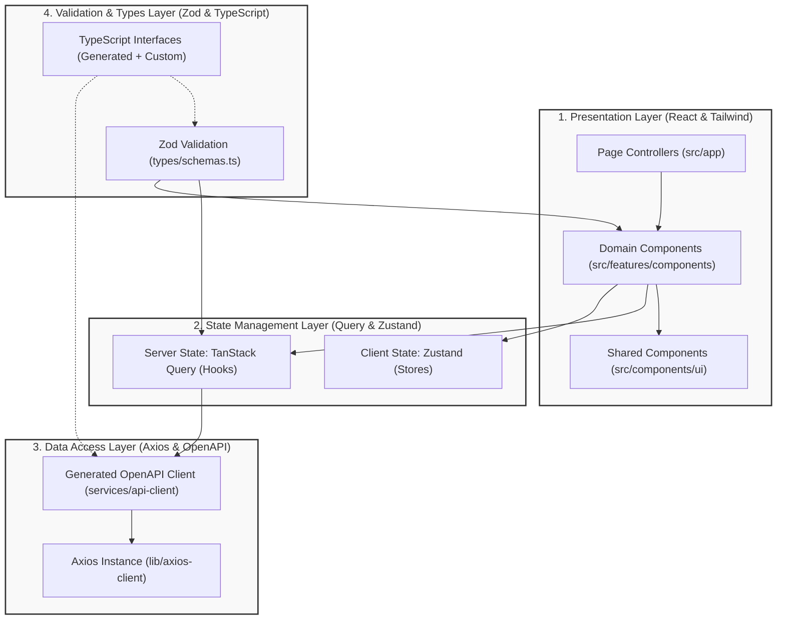

# HRMS Enterprise Admin Web Application: Frontend Architecture Blueprint

This document defines the official, production-grade frontend architecture for the **Enterprise HR & Payroll Management System (HRMS) Admin Web Application**. This blueprint serves as the definitive reference for developers, ensuring consistency, modularity, scalability, and maintainability across the codebase.

---

## 1. Project Folder Structure

The application follows a structured Next.js (App Router) layout where route definitions are separated from business and feature logic. All core source code resides under the `src` directory.

```
PAYROLL/
  frontend/
    .husky/                    # Git hooks (pre-commit, pre-push)
    .github/                   # CI/CD workflows and PR templates
    public/                    # Static assets (images, fonts, favicons)
    src/
      app/                     # Next.js App Router (Routing & Layouts only)
        (auth)/                # Route Group: Unauthenticated authentication flow
          login/
            page.tsx           # Entry point for the login page
        (dashboard)/           # Route Group: Authenticated admin dashboard workspace
          layout.tsx           # Global sidebar, header, and RBAC context provider
          dashboard/
            page.tsx           # Dashboard landing (high-level widgets & metrics)
          employees/
            page.tsx           # Employee Directory page view
            [id]/
              page.tsx         # Detailed Employee Profile page view
          shifts/
            page.tsx           # Shift scheduler and templates page
          attendance/
            page.tsx           # Real-time attendance log & punch details
          leaves/
            page.tsx           # Leave requests & balance allocations
          payroll/
            page.tsx           # Payroll run processing, slips, and groups
          settings/
            page.tsx           # Global system and tenant configurations
        api/                   # Next.js API Routes (BFF/Proxies if required)
        globals.css            # Tailwind directives and core variables
        layout.tsx             # Root layout (HTML, body, meta tags, fonts)
        providers.tsx          # Root provider aggregator (Zustand, Query, Sonner)
      components/              # Shared Presentation UI (Component Library)
        ui/                    # Atomic, reusable design elements (shadcn/Radix style)
          button.tsx
          input.tsx
          dialog.tsx
          tooltip.tsx
        data-display/          # High-level display components (independent of feature domain)
          data-grid.tsx        # Styled AG Grid Community wrapper
          metric-card.tsx      # Standardized dashboard widget container
          chart-card.tsx       # Recharts configuration wrappers
        feedback/              # Alerts, toasts, skeletons, and loading indicators
          skeleton.tsx
          spinner.tsx
      config/                  # Global environment, configuration, and constant definitions
        env.ts                 # Type-safe environment variable parsing (Zod verified)
        constants.ts           # Non-feature global constants (pagination limits, app name)
      features/                # Feature-Based Modules (Domain slices encapsulating logic)
        auth/                  # Login, token management, session handling
        employees/             # Directory, profiles, bank details, documents, status history
        shifts/                # Templates, weekly rosters, assignments
        attendance/            # Biometric logs, punch corrections, locking
        leaves/                # Request approvals, balance adjustments, policies
        payroll/               # Runs, salary groups, compliance settings, settlements
        dashboard/             # Analytical widgets, statistics aggregation
      hooks/                   # Reusable, non-feature custom React hooks
        use-debounce.ts        # Input debouncing hook
        use-media-query.ts     # Responsive breakpoint evaluation
        use-local-storage.ts   # State persistence wrapper
      lib/                     # Infrastructure configurations & third-party initializations
        axios-client.ts        # Axios instance configuration with JWT interceptors
        query-client.ts        # TanStack Query client custom options
        store-utils.ts         # Custom helpers for Zustand stores
      providers/               # React Context Providers
        auth-provider.tsx      # Context managing RBAC permissions and session status
        theme-provider.tsx     # Color theme configurations (Light/Dark mode)
      services/                # Shared api services or SDK wrappers
        api-client/            # Generated OpenAPI TypeScript client
          types.ts             # Auto-generated schemas via openapi-typescript
      styles/                  # Specialized stylesheets outside tailwind configs
      types/                   # Shared TypeScript declarations
        common.d.ts            # Global API response envelopes and generic paging interfaces
      utils/                   # Pure utility functions
        formatters.ts          # Currency, number, and status display parsers
        date.ts                # Day.js utility wrappers (parsing, range generation)
        validators.ts          # Generic regex-based validation helpers
```

### Folder Responsibilities: Root Levels

*   `src/app/`: The routing layer. Files within this directory are strictly responsible for routing structure, layouts, and metadata definition. Page files (`page.tsx`) must remain extremely thin, importing feature components from the `features` folder. They act as controllers matching URLs to domain entry points.
*   `src/components/`: The design system core. This contains design system components (buttons, text fields, tables) that have no awareness of HRMS business entities. If a component uses HRMS domain concepts (like an "Employee Card"), it does **not** belong here.
*   `src/config/`: Configuration boundary. Handles static configuration and environment parsing. Ensures that undefined environment variables trigger a runtime crash on startup instead of silent failure.
*   `src/features/`: The business core. Houses all enterprise business domain code, isolated by domain slices. Contains features such as `employees` or `payroll` which are completely self-contained.
*   `src/hooks/`: Pure utility React hooks that lack business-specific context (e.g., measuring screen width, local storage hooks).
*   `src/lib/`: Customizes external dependencies. Configures Axios interceptors, TanStack Query defaults, and client caches.
*   `src/providers/`: Root-level context wrappers. Injects theme, queries, and authentication contexts into the React component tree.
*   `src/services/`: SDKs, generated code from OpenAPI specifications, and global API wrappers.
*   `src/types/`: Global, shared type overrides, TypeScript utility definitions, and common request/response envelopes.
*   `src/utils/`: Pure helper functions. They do not maintain React state, rely on hooks, or generate HTML. They perform basic transformations (e.g., converting a ISO string to localized Indian Currency or relative date formats).

---

## 2. Feature-Based Architecture (Slices)

To maintain stability at scale, the application enforces a **Package-by-Feature (Slice)** architecture. Every module is a modular domain unit inside `src/features/`. 

### Anatomy of a Feature Slice

A feature directory (e.g., `src/features/employees/`) is structured into functional layers:

```
src/features/employees/
  components/                  # Presentation Layer
    employee-table.tsx         # Domain component wrapping AG Grid
    employee-form.tsx          # Form capturing demographic data
    employee-profile-card.tsx  # Read-only UI panel
  hooks/                       # State & Query Layer
    use-employees-query.ts     # Fetches paged lists of employees (TanStack Query)
    use-employee-detail.ts     # Fetches single employee entity
    use-employee-mutations.ts  # Handles Create, Update, Exit, Rehire triggers
  services/                    # Network & Data Layer
    employee-api.ts            # Network functions mapping to Axios calls
  store/                       # Client UI State Layer
    use-employee-store.ts      # Zustand store for UI states (e.g., active filters)
  types/                       # Domain Interface Layer
    index.ts                   # Types derived from Zod and OpenAPI definitions
    schemas.ts                 # Zod validation schemas for forms
  index.ts                     # Public entry point (Barrel Export)
```

### Feature Folder Responsibilities

*   `components/`: Component implementations containing styling, layout, user interaction handlers, and simple states (e.g., tab toggling).
*   `hooks/`: Orchestrates state and network operations. Integrates TanStack Query queries/mutations with domain actions. Houses cache invalidations and side effects (like triggering alerts or updating table records on completion).
*   `services/`: Encapsulates endpoints. Maps HTTP calls, payloads, query strings, and multipart parameters for the specific domain module.
*   `store/`: Client-side UI state tracking (e.g., temporary storage for multi-step hiring wizards, column visibility configurations, panel expansions).
*   `types/` & `schemas.ts`: Domain models and frontend schemas. Bridges generated OpenAPI models to local component typings, and defines Zod structures for client-side form validations.
*   `index.ts`: The public API file. This file exports only the interfaces, types, components, and hooks that other parts of the application are allowed to import.

---

## 3. Shared vs Feature Modules

To prevent circular dependency graphs and code duplication, developers must follow a strict boundary between shared infrastructure components and feature-specific components.

### Boundary Definitions

*   **Shared Components (`src/components/`):** Must be highly generic, reusable, and completely agnostic to HRMS business logic. They accept parameters solely as primitive types, callback handlers, or configuration configurations. They do not import from `features` under any circumstances.
*   **Feature Modules (`src/features/<name>/`):** Contain specialized, contextual business logic. They understand data shapes (e.g., `EmployeeCreateRequest` or `SalaryType`), handle specific domain actions, and process authorization permissions. They may import shared components, global configurations, and core utilities.

### Module Comparison Matrix

| Property | Shared Module (`src/components/ui/`) | Feature Module (`src/features/...`) |
| :--- | :--- | :--- |
| **Domain Awareness** | Completely unaware (No business terms, no domain model mappings) | Fully aware (Imports DTOs, schemas, models, and enums) |
| **Network & API** | No direct networking. Cannot call Axios, query clients, or services. | Integrated. Directly imports services, triggers mutations, and handles invalidations. |
| **State Dependencies**| Internal React states (`useState`, `useRef`). Unlinked from global stores. | Linked to global stores (Zustand, Query) and contextual providers. |
| **Auth & RBAC** | Agnostic. Does not check permissions or roles. | High awareness. Selectively hides elements via `require_permission` guards. |
| **Styling** | Utility-based styling via Tailwind with custom overrides. | Wraps shared elements in local layout structures and dashboards. |

### Inter-Feature Communication Rules

Features must remain decoupled. When Feature A needs to communicate with Feature B, the following guidelines apply:
1.  **Strict Avoidance of Private Imports:** Feature A must **never** import files directly from Feature B's internal layout (e.g., `@/features/payroll/components/payroll-calculation-form.tsx` is forbidden).
2.  **Public API Gate:** Feature A can only import from Feature B's public barrel file (`@/features/payroll`).
3.  **Global Handlers / Shared Layouts:** If a view requires complex interactions between multiple features (e.g., displaying employee shift assignments inside an attendance roster), the orchestration is handled by the **parent page** in `src/app` or an **orchestrating feature module** designed for that composite view, binding Feature A's components and Feature B's hooks together.

---

## 4. Layer Responsibilities

The application implements a clean architecture consisting of four decoupled layers: Presentation, State, Data Access, and Validation.



### 1. Presentation Layer (UI Component and Pages)
*   **Technologies:** React, Tailwind CSS, Lucide React (icons), Radix UI (primitives).
*   **Responsibility:** Renders the interface, captures user inputs, and delegates control to custom hooks.
*   **Core Principle:** Page components in `src/app` must contain **no inline style sheets, no direct async fetch logic, and no complex logic**. They import composite components from the feature directories and pass parameters down.

### 2. State Management Layer (Global, Client, and Server State)
*   **Technologies:** TanStack Query (React Query) v5, Zustand.
*   **Responsibility:** Separates state lifecycle:
    *   **Server State (TanStack Query):** Manages caching, background fetching, pagination cursors, mutations, and query validations. No backend data is stored in global React Contexts or Zustand.
    *   **Client State (Zustand):** Manages runtime UI state that does not persist on the server (e.g., sidebar toggles, step tracking in multi-step dialogs, selected filter criteria).
*   **Core Principle:** Avoid using Zustand as an intermediary cache. Server-derived data is read directly from TanStack Query hooks.

### 3. Data Access Layer (HTTP Networks and Integrations)
*   **Technologies:** Axios, openapi-typescript.
*   **Responsibility:** Manages all HTTP request and response flow:
    *   **Interceptors:** Injects authentication headers, catches 401 Unauthorized errors to execute silent token refresh sequences via refresh cookies/tokens, and translates system errors into standardized objects.
    *   **Auto-generated Types:** Leverages FastAPI's OpenAPI JSON format to generate TypeScript schemas, ensuring frontend models align with backend DB models.
*   **Core Principle:** Endpoint logic must remain declarative. Raw fetch operations are kept within `features/<name>/services/`.

### 4. Validation & DTO Layer (Validation and Domain Specifications)
*   **Technologies:** Zod, TypeScript.
*   **Responsibility:**
    *   **Zod Schemas:** Define runtime validation constraints for client-side forms. Forms integrated with `react-hook-form` and `@hookform/resolvers/zod` validate input schemas before transmission.
    *   **DTOs:** TypeScript types derived from Zod schema definitions (`z.infer<typeof schema>`) and generated OpenAPI schemas provide compile-time verification across the application.
*   **Core Principle:** Maintain a 1:1 mapping between Zod client schemas and backend API schemas. All validation errors are displayed dynamically within the form inputs.

---

## 5. Folder & File Naming Conventions

Strict naming conventions ensure predictability and quick navigation in a large project.

### Casing Conventions

| Target | Casing Format | Example |
| :--- | :--- | :--- |
| **Folders** | Kebab-case (lowercase separated by dashes) | `employee-directory`, `shift-templates` |
| **React Components** | PascalCase | `EmployeeTable.tsx`, `SidebarLayout.tsx` |
| **React Hooks** | camelCase (prefixed with `use`) | `useEmployeeQuery.ts`, `useAuth.ts` |
| **Services, Constants, Utilities** | camelCase | `employeeApi.ts`, `env.ts`, `dateUtils.ts` |
| **Zod Schemas** | camelCase (suffixed with `Schema`) | `employeeCreateSchema.ts` |
| **TypeScript Types/Interfaces**| PascalCase | `EmployeeDetail`, `ShiftAssignment` |
| **Config files (tooling)** | snake\_case or kebab-case | `tailwind.config.js`, `postcss.config.js` |

### Suffix & Extension Rules

*   **Page Files:** Must use Next.js App Router defaults: `page.tsx` for pages, `layout.tsx` for layout wrappers, `loading.tsx` for loading states, and `error.tsx` for error boundaries.
*   **Components:** Must use `.tsx`.
*   **Logic files (hooks, utils, services):** Must use `.ts`.
*   **Style files:** Must use `.css`.
*   **Unit Tests:** Must co-locate with target files using the `.test.ts` or `.test.tsx` suffix (e.g., `useEmployeeQuery.test.ts`).

---

## 6. Import Strategy

To keep features decoupled, the import flow between directories follows strict boundary rules.

```
+-------------------------------------------------------------+
|                        src/app/                             |
+------------------------------+------------------------------+
                               | (Imports from features, components, lib, etc.)
                               v
+-------------------------------------------------------------+
|                      src/features/                          |
+------------------------------+------------------------------+
                               | (Imports from components, lib, utils, hooks)
                               v
+-------------------------------------------------------------+
|             src/components/ | src/lib/ | src/utils/        |
+-------------------------------------------------------------+
```

### Import Rules

1.  **Unidirectional Flow:** Higher-level directories can import from lower-level directories, but lower-level directories cannot import from higher-level directories.
    *   `src/app` -> can import from `src/features`, `src/components`, `src/lib`, etc.
    *   `src/features` -> can import from `src/components`, `src/lib`, `src/utils`, `src/hooks`, `src/services`.
    *   `src/components` -> **cannot** import from `src/features` or `src/app`.
2.  **Strict Feature Isolation:** Feature modules cannot perform deep imports into other features.
    *   *Bad:* `import { EmployeeCard } from "@/features/employees/components/EmployeeCard"` (inside `src/features/shifts/`)
    *   *Good:* `import { EmployeeCard } from "@/features/employees"` (using the public barrel file)
3.  **Third-Party Wrapping:** Features should avoid importing raw library methods directly if wrapper utilities exist (e.g., import formatting functions from `@/utils/date` rather than raw `dayjs` calls to ensure localized date formatting).

---

## 7. Barrel Export Strategy

A barrel export (using `index.ts` files) centralizes exports from a directory, defining its public API surface.

### Implementation Guidelines

1.  **Feature Level Boundaries:** Every feature module must contain an `index.ts` file at its root. This file acts as the public contract for the feature, exposing only the selected components, hooks, and types required by the rest of the application.
2.  **No Internal Barrels:** Avoid creating `index.ts` files within internal subfolders of a feature (e.g., do not place `index.ts` in `src/features/employees/components/index.ts`). Doing so increases the risk of circular dependencies when components reference each other.
3.  **Exclusion of Page-Level Routing:** Do **not** use barrel files within Next.js route groups (`src/app`), as Next.js relies on file-system routing based on folder structure.

### Example: Feature Public API (`src/features/employees/index.ts`)

```typescript
// Explicitly export public components
export { EmployeeDirectoryTable } from './components/EmployeeDirectoryTable';
export { CreateEmployeeDialog } from './components/CreateEmployeeDialog';

// Explicitly export public hooks
export { useEmployeeDetail } from './hooks/useEmployeeDetail';
export { useEmployeeMutations } from './hooks/useEmployeeMutations';

// Explicitly export types
export type { EmployeeSummary, EmployeeDetail } from './types';
```

*By avoiding `export *` wildcards, we minimize bundling overhead, improve tree-shaking efficiency, and prevent namespace collisions.*

---

## 8. Absolute Import Configuration

To eliminate fragile relative paths (e.g., `../../../../components/ui/button`), absolute import paths are configured using path aliases.

### Path Mapping Configurations

The `@/*` alias is mapped directly to the `src/*` directory. This is configured in the root of the project:

#### 1. TypeScript Configuration (`tsconfig.json`)

```json
{
  "compilerOptions": {
    "baseUrl": ".",
    "paths": {
      "@/*": ["src/*"]
    }
  }
}
```

#### 2. Next.js Configuration (`next.config.js`)

Modern Next.js versions support this mapping natively when `tsconfig.json` paths are defined, ensuring support in both Server Components and Client Components during compilation.

### Usage in Code

```typescript
// Avoid:
import { Button } from '../../../../components/ui/button';
import { useAuth } from '../../providers/auth-provider';

// Use:
import { Button } from '@/components/ui/button';
import { useAuth } from '@/providers/auth-provider';
```

---

## 9. Scalability Guidelines

To support continuous development without performance degradation, the following guidelines apply:

### 1. Code Splitting and Dynamic Routing

Next.js page components leverage dynamic imports (`next/dynamic`) to split large libraries into lazy-loaded chunks:

*   **AG Grid and Recharts:** These represent significant bundle overhead. They must be wrapped in client components and imported dynamically with loading placeholders.
*   **Lazy Modals and Dialogs:** Dialogs that are hidden by default (e.g., `SalaryRevisionDialog`, `ExitInterviewForm`) must be dynamically imported to avoid loading their code until the trigger button is clicked.

```typescript
// Example: Dynamic import of heavy AG Grid component
import dynamic from 'next/dynamic';

const AsyncAGGridTable = dynamic(
  () => import('@/features/employees/components/EmployeeTable').then((mod) => mod.EmployeeTable),
  { ssr: false, loading: () => <TableSkeletonPlaceholder /> }
);
```

### 2. Synchronization with OpenAPI Specifications

To prevent schema mismatch bugs, API typings are kept in sync with the FastAPI backend:

*   **Generation Script:** A `package.json` command runs `openapi-typescript` against the backend's OpenAPI JSON endpoint to regenerate `src/services/api-client/types.ts`.
*   **Integration:**
    ```bash
    npm run api:generate
    ```
*   **Process:** Developers run this script during API changes. Standard types are automatically updated, causing the TypeScript compiler to highlight any breaking changes.

### 3. Rendering Optimization (AG Grid Community)

AG Grid Community is the core engine for displaying HRMS list views (e.g., payroll entries, punch logs, employee lists). To keep rendering performant:

*   **Infinite Row Model:** Do not load large tables into client memory. Implement server-side pagination with the Infinite Row Model using the backend's `page` and `page_size` query filters.
*   **Cell Renderers:** Keep cell renderer components simple. Avoid embedding interactive elements or hooks inside row cells; trigger modal states from parent components using row event listeners instead.

### 4. Client State Optimization (Zustand & React Query)

*   **Zustand Selectors:** Component hooks must use selectors to read state from Zustand (e.g., `useEmployeeStore(state => state.activeFilter)`). This avoids unnecessary re-renders when unrelated properties change.
*   **Query Keys:** Standardize Query keys in a central object (e.g., `employeeKeys.list(filters)`) to manage cache invalidations predictably across different features.

### 5. Automated Enforcement (Git Hooks & Linting)

Automated linting and formatting pipelines prevent code quality degradation:

*   **Husky:** Intercepts Git commits via `pre-commit` hooks.
*   **Lint-Staged:** Runs `eslint --fix`, `prettier --write`, and `vitest related --run` only on files that have changed.
*   **ESLint Configuration:** Restricts deep feature imports and enforces clean import structures.

```json
// Example: Lint-staged script configuration inside package.json
"lint-staged": {
  "*.{js,ts,tsx}": [
    "eslint --fix",
    "prettier --write"
  ],
  "*.css": [
    "prettier --write"
  ]
}
```

*   **Test Suite Verification:** Standardize unit testing via Vitest and React Testing Library (RTL). Unit tests target hooks, reducers, and helper utilities. Page routing flows are tested via integration tests.

---

## 10. Summary of Architectural Flow

The diagram below outlines a request's journey from a UI event down to the data access layer:

```
[Page View: src/app/employees/page.tsx]
       |
       v  (Renders)
[Feature Entry Component: EmployeeDirectoryTable.tsx]
       |
       v  (Uses Hook for Querying Data)
[Custom Query Hook: useEmployeesQuery.ts]
       |
       v  (Triggers Cache Check or Fetch)
[Network API Request: employeeApi.ts]
       |
       v  (Executes Call via Pre-configured Instance)
[Axios Client: lib/axios-client.ts]
       |
       v  (Translates HTTP Response into Typed DTO)
[OpenAPI Type Mapping: services/api-client/types.ts]
       |
       v  (Passes Data Back to Hook for Caching)
[Render UI Update via Presentation Layer]
```

By following this flow, dependencies remain isolated, logic is modular, and the codebase can scale as new features are added to the HRMS application.
